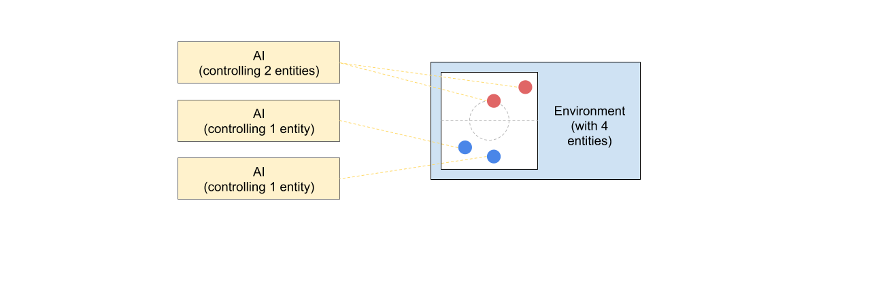
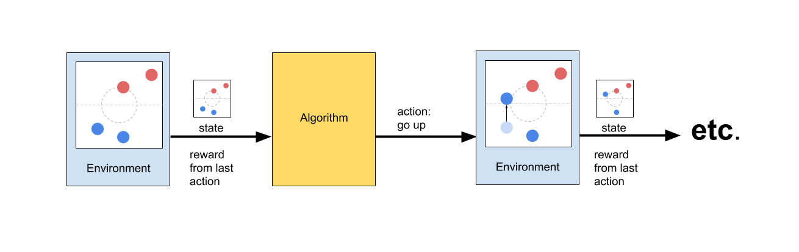

# Deep Reinforcement Learning
The AI Arena is a framework to enable researchers, simulation designers, and software engineers to make use of a powerful technique in AI called deep reinforcement learning.  This document reviews the main ideas behind deep reinforcement learning (DRL) and primarily serves as a glossary of terms.  For details about how DRL learns and algorithm specifics, a good resource is [Spinning Up](https://spinningup.openai.com/en/latest/) by OpenAI.

## What is Deep Reinforcement Learning (DRL)?
Deep reinforcement learning, or DRL for short, is a marriage of two powerful ideas: deep learning, and reinforcement learning.  Deep learning uses neural networks to approximate complex functions or useful mappings, such as a mapping from images of animals to a string of the name of that animal (object recognition), or text of one language to text of another (machine translation).  

Reinforcement learning (RL) tries to learn a specific function: a map from the current state of some environment to the best action for that an agent to take.  For example, this might be a function that takes as input the state of a chessboard and outputs the best move to make for white (the "environment" is chess and the "agent" is the player using the white pieces.  More on this shortly).

Naturally, these two techniques fit well together.  DRL is simply an extension of RL in which the function mapping states to actions is representated as a neural network.  There are other functions that are often used in DRL which are also helpful, such has mapping states to some score of how good that state is, or mapping actions to some score of how good that action is.  The goal is always the same: to find the best set of actions to complete a task.

## Basic Components
There may be some word choices above that seem a bit strange.  Words like "environment" and "agent" mean specific things in DRL lingo, and they will discussed here:

### Environment _aka: game, simulation, task, problem_
The **environment** is the world in which the AI exists, and often represents the problem that needs to be solved.  It may take the form of a simulation, video game, or real world scenario in which the AI has control over certain aspects of the world.

### Agent _aka: player, entity, bot_
The **agent** is the object that an AI is controlling within an environment.  It may take the form of a set of pieces in a board game, a character in a video game, or an entity in a simulation.  The AI is trying to accomplish some goal by optimizing the behavior of this agent.

Some examples:
- Chess: The environment is the game of chess, there are two agents: black and white.
- Pong: The environment is the Atari game Pong, the agent is the player's paddle.
- Self-driving car simulation: The environment is the simulated world, the agent is the car

### AI _aka: algorithm, DRL, learner, policy_
The **AI** is the external learning mechanism that is in control of a particular agent.  It uses the agent to explore the environment and try out different courses of action, eventually learning the best course of action.  This is sometimes also called a "policy," although this has a more technical definition (see the next section).

### Agent vs AI
_Agent_ and _AI_ are often used interchangeably even though they can technically refer to different things.  The agent is essentially the physical (or simulated) embodiment of the AI, so by referring to one there is a natural association with the other.  It is common to say "the agent learns" or "the AI moves in the environment", and consider the AI and the agent to be the same system.

### Entity
The AI Arena makes use of the term **entity** to avoid the confusion above.  Often "agent" can be referring to either an algorithm or the object which the algorithm controls, so the Arena uses entity to specifically refer to a controllable object in an environment.  This is especially helpful if an AI is controlling multiple things at once, in which case "agent" could refer to a specific thing being controlled, or the collection of things being controlled, depending on the algorithm used.  Meanwhile, entity always refers to a single thing which is controllable.

## Data
The AI controls an entity in the environment by commanding it based on the current state of the environment.  Furthermore, the environment provides the AI with some information about how well it is completing the current task.  Some common terminology for these pieces of data include:

### Observation / State
An observation is a piece of data that describes the current state of the environment from the perspective of a given entity.  This is the information that the AI uses to make decisions.  It is often a vector of numbers (i.e. the joint angles of a robot, position of other objects), or an image (8x8 image of chessboard, view from a camera, etc).

### Action
"Actions" are the output of the AI which command the entity.  Generally there are two types of actions, only one of which will be used in a given problem: **Discrete** actions describe a choice for the AI to make with no middle ground (Do something or not).  For example, when playing Pong the paddle can go left OR right OR stay where it is.  The increment of how far to the left or right is built into the game and is not under the AI's control.  **Continuous** actions describe float-valued commands to an entity which may control multiple degrees of freedom simultaneously (How much to do something).  For example, a simple self-driving car could be controlled with two continuous actions: one value could describe the angle of turning the wheel and another could describe how much to accelerate or brake.

### Reward (aka Reward Signal)
"Reward" is the measurement of how successful an AI's actions are (a single number for each step). The entire goal of the AI is maximize the amount of reward it collects overtime, so the job of the engineer is to provide a good measurement of success to the AI via the reward.  Critically, the reward only needs to measure instantaneous success, and the AI will optimize long-term success.  For example, a chess-playing AI can be given a reward of 1.0 when it delivers checkmate, -1.0 when it loses, and 0.0 for all over in-game moves.  It may then learn to correctly sequence moves that lead to positive reward (winning the game).

## RL Components
A DRL algorithm is often composed of several pieces that are used together to manage data and learn from experience.  To start with, there are several different types of functions that the AI may want to learn, approximated with neural networks:
- Policy: A policy is a mapping from states to actions. This is the most critical function that a DRL algorithm learns, as it directly controls the agent.
- Value: A value measurement is a description of the relative inherent worth of a particular state, based on what rewards will be obtainable in the future from that state.
- Advantage: An advantage measurement is a description of how good an action is relative to the other possible actions at a particular time.
- Q-Value: A Q-value is the relative inherent worth of a state and an action together.  This describes how worthwhile it is to both be in a particular state and decide to execute a particular action.  It is simply the sum of the value and the advantage when the AI takes an action from a particular state.

### Common Confusion: Value vs Advantage
These all sound extremely similar at first glance and are better explained with an example.  A good example to think about here is American football:

State: Suppose you have the ball on your opponent's one-yard line.  In this instant, there are a few things you could measure:
Value: This position, regardless of what happens next, is inherently very valuable.  You are only one yard away from a touchdown, which is a much better place to be than most of the rest of the field.  

Advantage of Certain Actions:
a) Running into the endzone here would probably be the best thing to do.  It has a high advantage over other actions.
b) Running the ball out of bounds is less good, but not the worst thing that could happen.  This probably has a fairly neutral advantage.
c) Running in the opposite direction or fumbling the ball are examples of things with low advantage, since they lead to bad outcomes.

Note that these measurements of advantage are all relative to each other, and are independent from the value measurement.  We know we are in a good state, but we can independently evaluate how good our various actions would be if carried out.

### Workers
The AI Arena makes use of a libary called MPI to scale learning across many processes.  Most DRL algorithms can be parallelized, and make use of **workers**.  Typically, a worker is a copy of the algorithm that is paired with a copy of the environment.  Many groups of environments and workers exist at once, and the workers pool there knowledge together to train more quickly and more robustly.  Although a worker has all the pieces of a DRL algorithm: a neural network, mechanisms to collect data, etc, it is only one piece of the larger algorithm which may be using tens or hundreds of workers simultaneously.
