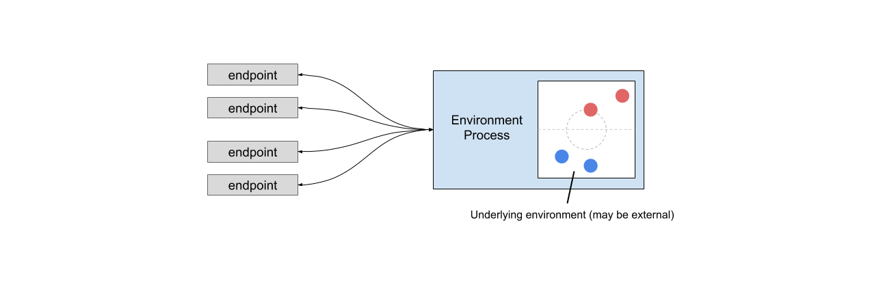
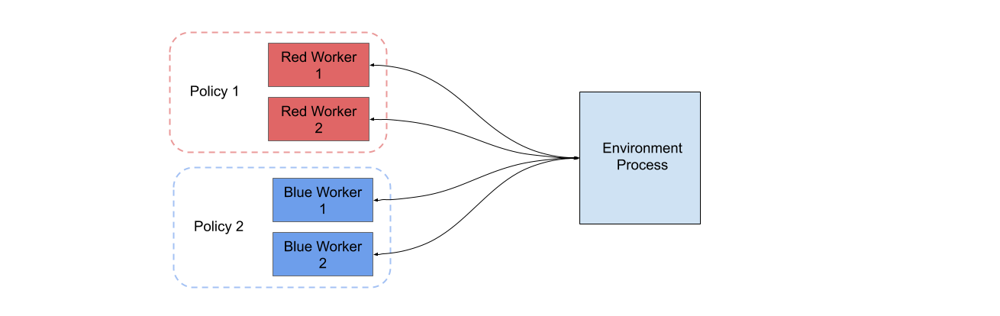
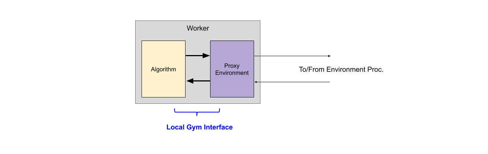
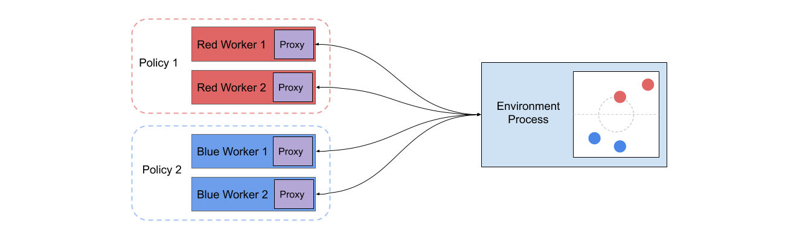
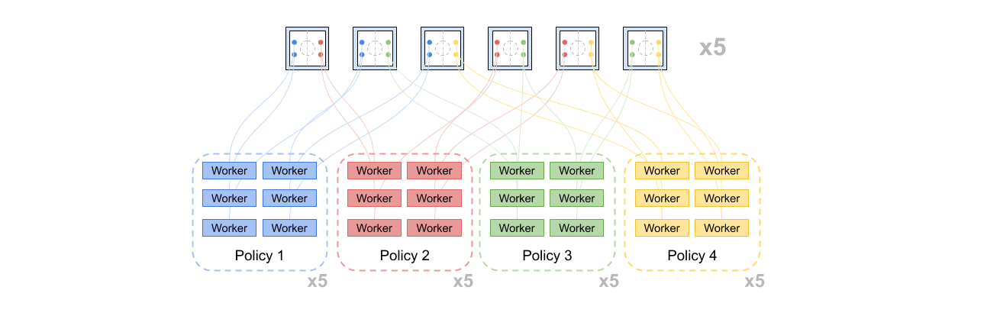

# AI Arena Structure

The AI Arena uses [MPI](https://mpi4py.readthedocs.io/en/stable/) to distribute work among many processes and coordinate messaging between them.  In addition to a **root process**
 which manages high-level training objectives, Arena processes can generally be divided into two types: **environment processes**, and **worker processes**.  

## Environment Processes
The simplest type of processes that exists when the AI Arena is executing distributed training are environment processes.  These are python processes that provide access to a training environment, either by wrapping a python object directly or serving as a middle man to some external environment.

Environment processes use MPI to gather actions from many different endpoints and step the underlying environment.  The environment will return information that is relevant to each of the endpoint sources, so the environment process then broadcasts this response back to each of the endpoints.  

If you are familiar with the Gym interface, you may intuit that the endpoints are various agents communicating with the environment.  The agents are sending actions (or reset commands) to the environment process, where they are aggregated and used to step the environment all at once.  State, reward, done, and info data are broadcast back to each agent for their respective entity in the environment, thus completing the Gym interface loop.

## Worker Processes
The "endpoints" referred to above are the worker processes.  These are python processes that encapsulate a worker that is contributing to learning a policy.  The job of a worker process is to receive information about the entity that it controls, make a decision to control that entity, and send this decision back to the environment.  The first goal of a worker is data collection: the worker process records all of these decisions and the information they were conditioned on.  The second goal is distributed training: in coordination with other workers representing the same policy, the workers will learn to improve their policy.

The AI Arena uses MPI to coordinate training among many workers that contribute to the same policy.  These workers may be speaking to different environments or simply different entities within the same environment, but they will pool the data that they collect.  Critically, the Arena allows multiple distinct policies to exist at the same time, each with their own workers.

## Environment Proxies
How does the worker communicate through a Gym interface and use MPI at the same time?  Does this mean existing RL algorithms need to be modified to use MPI instead of normal python calls?

Fortunately, no.  The AI Arena takes care of all this interfacing and messaging can of worms by providing to each worker an object called an environment proxy.  This python object behaves like a standard Gym environment (or Arena Multiagent environment depending on your setup), and allows each worker to locally communicate with an object that it believes is a true environment.  However, behind the scenes this proxy uses MPI to pass data over to an environment process and receive a response, and then return this response locally within the worker process.  The algorithm contained in the worker has no idea it is communicating with something in an entirely different process, possibly even on a different machine!

## Putting it All Together: An Example
Putting the above pieces together we can see how the Arena manages to distribute the system of training across many different processes.  Several one or more policies are represented by various workers.  These workers locally communicate with an environment proxy, which forwards their decisions to an environment process.  The environment process pools decisions from many workers, enough to step the environment one time.  Then it sends back a reply, which via the environment proxies are delivered to each worker.  The workers may then use MPI amongst themselves to coordinate a policy update.

In the diagram below, consider a 2v2 game of some kind.  The blue team is learning one policy, and the red team is learning another.  The each team has two entities and also has two workers: one for each entity.  The AI arena coordinates this setup among 5 process: two blue workers, two red workers, and one environment.  There is also a sixth process which is the Arena root process.

## Scale: The True Power of the Arena
The above example may strike you as overkill.  A 2v2 game needs 6 separate processes to train? Ridiculous.  For this simple example, it probably *is* overkill.  However, the true power of the Arena is not in maintaining a single game, but rather to maintain many games, with many copies of each game in existence at once.  Furthermore, it allows for many different policies to train simultaneously, all while hooked into one or more of these different games.  This is the true power of the Arena, to manage many workers across many games, training all at the same time.

Consider below a more substantial example.  We would like to introduce two new policies, so our policy pool now contains: red, blue, green, and yellow.  Consider training them in a round-robin fashion.  We would like each policy to train against each other policy, for a total of 6 games.  We would like to do this at scale, replicating each game 5 times for a total of 30 simultaneous games.  Now our diagram looks like this (replicated 5 times over):

All of this is orchestrated by the Arena if we simply tell it which policies we have and how we want to match them up.  Running on a small cluster, the Arena would manage this training scheme across 151 processes, and all four policies would be learning simultaneously by pooling data from their respective workers.  
