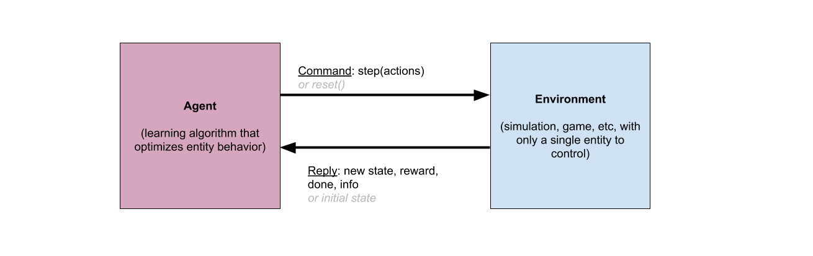

# Open AI Gym Interface

The AI Arena uses two different interfaces to connect environments and agents.  The first is the [OpenAI Gym interface](https://gym.openai.com/docs/), which was developed by OpenAI and has become a widely-accepted standard in deep reinforcement learning.  This interface allows a single agent to control a single entity in an environment.  The interface is typically constructed as a set of methods on the environment side, the primary ones being ```reset()``` and ```step(action)```:

```python
def reset(self):
	# resets the environment
	# returns: the state of the environment after being reset
```

```python
def step(self, action):
	# steps the environment forward by applying the provided actions
	# returns: state, reward, done, info
		# state: the state of the environment after the step
		# reward: a float indicating the reward gained during this step
		# done: a boolean indicating if the episode is over
		# info: a dictionary, often empty, containing additional information
```

This necessitates a program flow that is often diagramed as follows:



Note that in this paradigm, the algorithm is the driver of the system.  The agent is sending commands to the environment to either reset or step forward, and otherwise the environment is frozen in time.

Additionally, some edge cases of this interface can be left undefined, including: calling reset() before an episode is finished (before done==True), and calling step() before having ever called reset().

## Additional Methods:

The Gym interface has several other methods which are sometimes implemented.  Commonly, ```seed(seed_num)``` and ```render()``` will be present in an environment.  The AI Arena makes use of ```render()```, but not ```seed()```, as it is expected that randomization is handled externally.

```python
def render(self):
	# display the environment for a human to watch or monitor the agent's behavior
```

If your environment exposes render(), you can set ```render=True``` when calling ```arena.kickoff()```. See the tutorial documents for more information.

One additional method that is rarely used in Gym environments is the ```close()``` method.  This is used by the Arena to shut down an environment at the end of a round of training.  It is only necessary if you plan to train over several rounds, such as when implementing a progressive tournament or evolution over DRL.  An example of this type of training can be found in the Atari Evolution tutorial.

```python
def close(self):
	#close the environment
```

## Gym Spaces
In addition to methods, environments are expected to provide two fields: ```self.observation_space``` and ```self.action_space```.  These are python objects that describe the format of data representing environment state and agent actions.  This typically consists of specifying the expected shape of the data as well as upper and lower bounds for values in the data.  For implementation examples and further explanation, see the Gym documentation: [OpenAI Gym Spaces](https://gym.openai.com/docs/#spaces).
