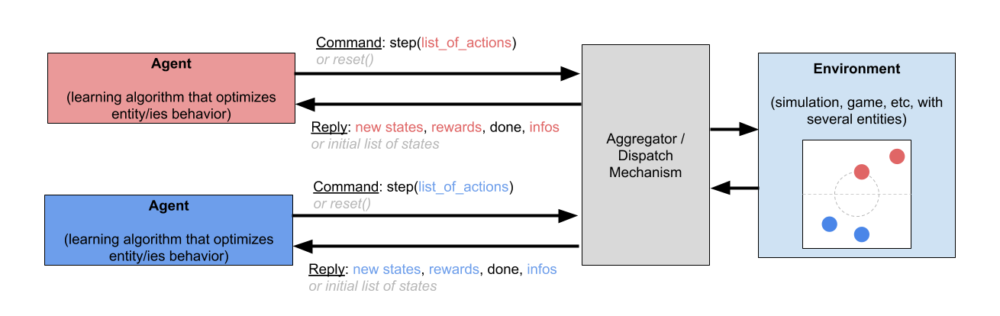

# AI Arena Multiagent Interface

The AI Arena uses a slightly modified Gym interface to support environments that contain multiple entities, and which are controlled my multiple agents simultaneous.  The only modification is that wherever single items are used by the standard Gym interface, the Arena Multiagent Interface expects python lists:

```python
def reset(self):
	# resets the environment
	# returns: a list of the states of each entity after being reset
```

```python
def step(self, list_of_actions):
	# steps the environment forward by applying the provided actions
	# returns: states, rewards, done, infos
		# states: a list of states, one per entity
		# rewards: a list of rewards, one per entity
		# done: a boolean indicating if the episode is over
		# infos: a list of info dictionaries, one per entity
```

Note that ```done``` is still only a single value, since the end of an episode would apply to all entities.  

This can be diagrammed similar to the OpenAI Gym interface in the previous document.  In this example we have a 2v2 game in which each team is controlled by an agent:



Since the environment is now receiving commands from multiple sources, it is necessary to collect these commands first before sending them to the environment.  Similarly, the response from the environment may need to be split up according to the various agents.  This aggregation and dispatching mechanism is built into the Arena. See the document on Arena Structure for more information about how this works internally.

## Gym Spaces
Where a Gym environment uses observation and action spaces, an environment using the Arena Multiagent Interface naturally uses lists of spaces.  These variables now have plural names:
```python
# Before, using a Gym interface:
self.observation_space = gym.spaces.Box(0.0, 1.0, (5,5,1))
self.action_space = gym.spaces.Box(-1.0, 1.0, (2,))

# Now, providing for multiple agents:
self.observation_spaces = [gym.spaces.Box(0.0, 1.0, (5,5,1)) for _ in range(4)]
self.action_spaces = [gym.spaces.Box(-1.0, 1.0, (2,)) for _ in range(4)]
```

Note that this interface allows different observation and action spaces _for each entity in the environment_.  For example the Touchdown environment (See Tutorial 1) supports images or vector states for each team, and either discrete or continuous actions for each team.  For a 1v1 setup, this may look something like:

```python
# blue entity uses images, red entity uses flattened vector
self.observation_spaces = [gym.spaces.Box(-10, 10, (84,84,1)), gym.spaces.Box(-10, 10, (4,))]

# blue entity uses continuous actions, red entity uses discrete
self.observation_spaces = [gym.spaces.Box(-1.0, 1.0, (2,)), gym.spaces.Discrete(5)]
```

## Converting Interfaces:

Since the AI Arena uses the custom Multiagent interface, but existing Gym environments are single-agent and adhere to the standard Gym interface, it can be necessary to convert between interfaces.  Fortunately, a single-agent environment can easily be represented as a multi-agent environment which has only a single entity.  Any lists used by this environment will only hold one entry.

The Arena provides a wrapper called single_agent_wrapper to use existing gym environments as multi-agent ones:
```python
from arena5.wrappers.single_agent_wrappers import *
...
my_env = single_agent_wrappers(my_gym_env)
```

This specific use-case is explored further in the Atari Tutorial.
