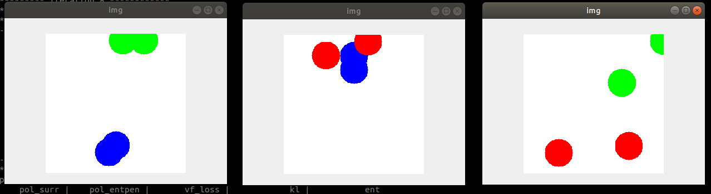
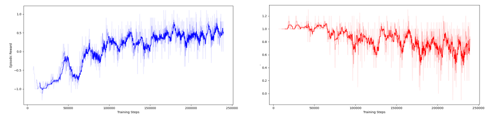
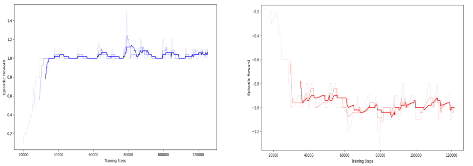

# Algorithm Hyperparameters and Environment Settings

One of the strengths of the AI Arena is the capability to set up complex training schemes that involve multiuple environments and/or multiple learning algorithms. However, it is often the case that multiple environments are not unique simulations, but rather many instances of the same environment with some variation in settings.  Similarly, when using multiple policies, they may all use the same algorithm but simply have different hyperparameters. This document explains how to pass parameters to environments and policies so that these customizations are possible.

## Environment Parameters

Environments are provided to the AI Arena with a ````make_env()```` method, often provided in a file called ````make_env.py````.  This method can optionally have custom parameters that further specialize an environment, making it possible to spin up a variety of environments rather than many identical ones.  This is important for training that involves varying distributions or imploying domain randomization, for example.

The ````round_robin_with_parameters```` example uses custom paramters to change the display color of the entites. In a custom environment, parameters can be used to modify environment mechanics as well (not just visuals).

````python
from Touchdown import TouchdownEnv

# 2 v 2 touchdown environment
# this will therefore expose 4 entities: team 1 (1 and 2) and team 2 (3 and 4)
def make_env(clr1=[], clr2=[]):
	return TouchdownEnv(2, blue_obs="image", blue_actions="discrete",
		red_obs="image", red_actions="discrete", clr1=clr1, clr2=clr2)
````

To set separate parameters for each environment, a list of dicts describing parameters for each environment can be passed in the main script:

````python
# define matches (environment instances)
match_list = [
	[1,1, 2,2],  # blue vs red
	[1,1, 3,3],  # blue vs green
	[2,2, 3,3]   # red  vs green
]

#define custom parameters for each match environment
red = (1.0,0,0)
blue = (0,0,1.0)
green = (0,1.0,0)

colors = [
	{"clr1":blue, "clr2":red}, 
	{"clr1":blue, "clr2":green}, 
	{"clr1":red, "clr2":green}
]

#train with this configuration
arena.kickoff(match_list, policy_types, 30000, render=True, scale=True, env_kwargs=colors)
````

The custom parameters should either be a single dictionary of parameters to pass to all environments, or a list of parameters that have a one-to-one correspondance with the match list.  They are passed into ````arena.kickoff()```` under the ````env_kwargs```` option.

Note that if scaling is turned on, parameters will be correctly applied to any duplicates of a particular match during scaling (i.e. all instances of match i will use parameters i).

The result of the above script is that each environment shows what teams are competing:




## Plot Colors

The round robin example also makes use of colors in plotting, which is especially helpful when multiple competing policies are involved in training.  Colors for each policy can be passed in ````(r,g,b)```` format where each value is in the range [0.0, 1.0]:

````python
red = (1.0,0,0)
blue = (0,0,1.0)
green = (0,1.0,0)

# ... #

policy_types = {1:"ppo", 2:"ppo", 3:"random"}

# ... #

plot_colors = {1:blue, 2:red, 3:green}

#train with this configuration
arena.kickoff(match_list, policy_types, 30000, render=True, scale=True,
	env_kwargs=colors, plot_colors=plot_colors)
````

These parameters are passed into ````arena.kickoff()```` under the ````plot_colors```` option. The format is simply a dictionary with the same keys as the policy dictionary, where each entry is a color.
This results in colored plots during logging (policy 3 not shown):




## Policy Hyperparameters

Similarly to environment parameters, policies can be passed parameters that customize their execution. This can be used to adjust hyperparameters, freeze a policy, or to provide different parameters to each policy. Just like plotting colors are set with a dictionary corresponding to policy numbers, policy parameters can be specified in the same way:

````python
policy_types = {1:"policy_type_1", 2:"policy_type_2", ...}

policy_hyperparameters = {
	1:{"learning_rate"=0.01, "batch_size"=64},
	2:{"learning_rate"=0.02, "gamma"=0.97}
}

arena.kickoff(match_list, policy_types, 30000, render=True, scale=True, policy_kwargs=policy_kwargs)
````

These parameters are passed into ````arena.kickoff()```` under the ````policy_kwargs```` option. The notation is simply a dictionary with named parameters. If a policy is not given hyperparameters in this way, the defaults specified in the policy class will be used.

As an example, lets look at changing the PPO hyperparameters for the round-robin example. The PPO class has the following ````__init___()````:

````python
def __init__(self, env, policy_comm, use_lstm=False, eval_mode=False, external_saved_file=None,
			timesteps_per_actorbatch=128, clip_param=0.2, entcoeff=0.01,
			optim_epochs=4, optim_stepsize=1e-3, optim_batchsize=64, gamma=0.99, lam=0.95, schedule='linear',
			verbose=1
		):
````

We will set the learning rate to zero for the red team, and look at the training logs to show that it is not learning:

````python
# policy #1 and #2 will be using the PPO algorithm, policy #3 will be random
policy_types = {1:"ppo", 2:"ppo", 3:"random"}

# optionally set kwargs for the policies, we will adjust hyperparameters for ppo #2:
# other policies will use the defaults, we do not need to include them here.
policy_kwargs = {2:{"optim_stepsize":0.0}}
````

After briefly training, this results in the following plots for ppo #1 (blue) and ppo #2 (red):



While policy 1 quickly improves, policy 2 quickly begins losing to policy 1 because it is not actually learning. With a learning rate of zero, its network updates have no effect.