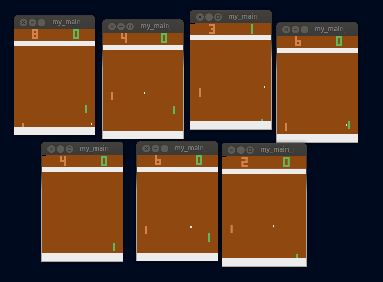

# Tutorial 02: Atari

## */examples/atari*
Possibly the most well-known benchmarks for deep reinforcement learning are Atari games, which were used in the groundbreaking 2013 paper, [Playing Atari with Deep Reinforcement Learning](https://arxiv.org/pdf/1312.5602.pdf).  In this tutorial we will walkthrough how to use the AI Arena to learn to play Pong. Pong is a single-agent game, so this also serves as a demonstration of how to use the AI Arena with existing single-agent Gym environments.


## Directory Setup

As in Tutorial 01, we will create a project folder and we will break our program into 3 files: **make\_env.py**, **my\_config.py**, and **my\_main\_script.py**.  Our config will be the same as in Tutorial 1.

## make\_env.py
Here we define a python method that the Arena can use to build an instance of the environment.  We will import gym as well as some wrappers for Atari games provided by the stable-baselines repository.  Critically, after making the environment, we will wrap it with **single\_agent\_wrapper**, which will convert it from a Gym interface to an Arena Multiagent interface.

```python
import gym
from stable_baselines.common.atari_wrappers import make_atari, wrap_deepmind
from arena5.wrappers.single_agent_wrappers import *
from mpi4py import MPI

def make_env():

	env = wrap_deepmind(make_atari("PongNoFrameskip-v4"))
	workerseed = MPI.COMM_WORLD.Get_rank()*10000 #seed each process differently, for diversity
	env.seed(workerseed)

	env = single_agent_wrapper(env)
	return env
```


## my\_main\_script.py
To train Atari, we will use an algorithm called Proximal Policy Optimization (PPO), which is the current state-of-the-art in single-agent games. Our ```policy_types``` variable will only contain one entry, which has been set to "ppo".

Furthermore, out ```match_list``` is a list of one, with the only entry being a list with one entity designation: [[1]].  This says, I have one unique match to play, and that match contains a single entity assigned to policy number 1.

The complete script is:

```python
from arena5.core.stems import *
from arena5.core.utils import mpi_print
from arena5.core.policy_record import *
from arena5.core.plot_utils import *

import my_config as cfg

arena = make_stem(cfg.MAKE_ENV_LOCATION, cfg.LOG_COMMS_DIR, cfg.OBS_SPACES, cfg.ACT_SPACES)

# --- only the root process will get beyond this point ---

match_list = [[1]]
policy_types = {1:"ppo"}
arena.kickoff(match_list, policy_types, 5000000, render=False, scale=False)

```

Note the high number of steps.  Unlike Touchdown, Atari games can take several hours to train, and often require millions of steps.  Since this is a more substantial run, we have also set render=False, since rendering will only slow down our progress.

## Running the Script (No Scaling)
To run our script, we will need to use MPI and provide at least 3 processes (1 environment, 1 policy with one worker each, and 1 root process).  We can easily accomplish this by running:
```
mpiexec -n 3 python my_main_script.py
```
This says: Execute with mpi, use 3 processes, and on them run: "python my\_main\_script".

## Running the Script (With Scaling)
We can run with more than 3 process if desired.  Each new match will require 2 more processes: 1 environment and 1 worker.  However, remember that the number 5000000 refers to number of steps **per match**.  If we scale up to many matches, our total number of steps across the whole system will similarly scale.

We can instead run approximately 5 million steps across all matches, regardless of scale, by making use of the **total\_steps\_to\_match\_steps** utility, which considers the match list as well as the total number of processes to determine how to evenly split-up the total number of desired steps:

```python
match_list = [[1]]
policy_types = {1:"ppo"}
steps_per_match = total_steps_to_match_steps(match_list, 5000000)
arena.kickoff(match_list, policy_types, steps_per_match, render=False, scale=True)  # scale=True now!
```

Now if we run:
```
mpiexec -n 15 python my_main_script.py
```
We will have 7 copies of Pong, each running for 5M/7 = ~714,000 steps.

## TODO: Results
[Show the produced plot after training]

## Rendering for Fun (Cool Demo)
If we set render=True and run with many processes, we can see many instances of Pong appear and begin to play.

i.e,
```
mpiexec -n 15 python my_main_script.py
```
will result in:



